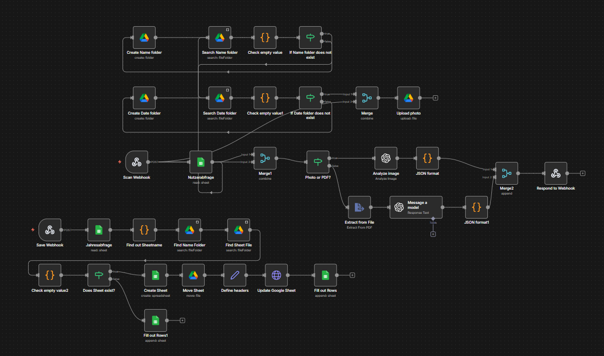
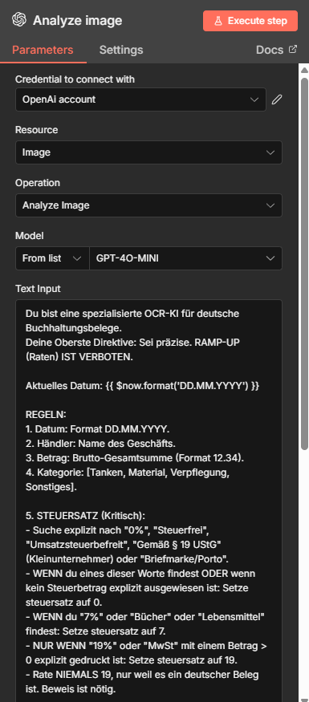

# AI-Powered Invoice & Receipt Automation

A self-hosted document-processing workflow that turns uploaded receipts and invoices into structured bookkeeping data using **n8n, OpenAI, Google Drive, Google Sheets, Docker, Caddy, and Azure**.

The project was built as an end-to-end business automation: users upload an image or PDF, the system extracts accounting data, lets the user review and correct the result, stores the original document in a structured Drive hierarchy, and appends the confirmed data to a yearly bookkeeping spreadsheet.

## Demo

[Watch the demo](https://youtu.be/HJhNPB6jTAc)

## Business problem

Small businesses often handle receipts and invoices through repetitive manual steps: uploading files, extracting values, organizing documents, and copying accounting data into spreadsheets.

This project automates that workflow while keeping a human verification step before data is finally stored.

## Solution

The application provides a lightweight web interface for uploading receipts and invoices.

After upload, the workflow:

- identifies the user through a token-based lookup,
- accepts both images and PDFs,
- routes each file type through the appropriate processing path,
- extracts structured accounting information with an AI model,
- converts the AI response into structured JSON,
- sends the extracted values back to the frontend for review,
- stores the original document in Google Drive,
- creates missing user/month folders automatically,
- creates or locates a yearly bookkeeping spreadsheet,
- appends the confirmed data to Google Sheets.

Extracted fields include:

- Date
- Merchant
- Gross amount
- VAT rate
- Category

## Architecture

```text
User
  │
  ▼
Web interface
  │
  │  image / PDF + user token
  ▼
n8n Webhook
  │
  ├── User lookup via Google Sheets
  │
  ├── File type detection
  │      │
  │      ├── Image ──► OpenAI Vision analysis
  │      │
  │      └── PDF ────► Text extraction ──► OpenAI analysis
  │
  ├── Structured JSON response
  │
  ▼
Human review in frontend
  │
  ▼
Save Webhook
  │
  ├── Google Drive filing
  │      └── User / Month structure
  │
  └── Google Sheets bookkeeping
         └── Yearly spreadsheet
```

## Key features

### AI-powered document extraction

Images are analyzed with an OpenAI vision model. PDF files follow a separate branch where text is extracted first and then processed by the model.

The workflow requests structured fields rather than free-form text and includes explicit VAT rules to reduce incorrect assumptions during extraction.

### Human-in-the-loop verification

AI output is not written directly to the bookkeeping sheet. The extracted values are returned to the frontend where the user can review and edit them before saving.

This provides a practical verification step for fields such as merchant, amount, VAT rate, date, and category.

### Multi-user workflow

Users are resolved through a token lookup in Google Sheets. This allows the workflow to associate uploads and bookkeeping data with the correct user without requiring a full authentication system for the prototype.

### Dynamic Google Drive organization

The workflow searches for the required user and month folders and creates them when necessary.

Documents can therefore be organized in a structure similar to:

```text
Belege_App_Uploads/
└── User/
    ├── 2026-08/
    ├── 2026-09/
    └── ...
```

### Automated bookkeeping spreadsheets

For each user, the workflow can create or locate a yearly spreadsheet such as:

```text
User_Belege_2026
```

Confirmed receipt data is appended to the `Belege` sheet with fields for date, merchant, gross amount, VAT rate, and category.

### Self-hosted deployment

n8n is deployed in Docker on Microsoft Azure.

Caddy acts as the reverse proxy and exposes the n8n instance over HTTPS through a custom domain.

```text
Internet
   │
 HTTPS
   ▼
Caddy
   │
   ▼
n8n :5678
```

## Tech stack

| Area | Technology |
| --- | --- |
| Workflow orchestration | n8n |
| AI / document extraction | OpenAI API |
| Workflow logic | JavaScript |
| Frontend | HTML, CSS, JavaScript |
| Integrations | Webhooks, Google Drive API, Google Sheets API |
| Containerization | Docker / Docker Compose |
| Reverse proxy / HTTPS | Caddy |
| Hosting | Microsoft Azure |

## Repository structure

```text
.
├── README.md
├── workflows/
│   ├── frontend.sanitized.json
│   └── invoice-processing.sanitized.json
├── frontend/
│   └── index.html
├── deployment/
│   └── docker-compose.yml
└── docs/
    └── screenshots-and-demo-assets
```

## What I built

This project covers more than a single n8n workflow. It combines frontend interaction, workflow orchestration, AI processing, external APIs, storage logic, bookkeeping automation, and cloud deployment into one end-to-end system.

It demonstrates practical experience with:

- designing multi-step business automations,
- integrating external APIs and OAuth-based services,
- processing binary files and PDFs,
- branching workflows based on file type,
- parsing and validating AI-generated structured output,
- implementing human review before persistence,
- dynamically creating and locating Google Drive resources,
- generating and updating Google Sheets programmatically,
- building webhook-based frontend/backend communication,
- deploying n8n with Docker,
- exposing a self-hosted service through Caddy and HTTPS.

## Screenshots




Recommended screenshots:

- Upload interface
- Review / correction interface
- Full n8n workflow overview
- Image vs. PDF branch
- OpenAI extraction node
- Google Drive folder logic
- Google Sheets creation / append logic
- Final Drive / Sheets result using test data

## Running the sanitized version

The repository contains sanitized portfolio exports. They are intended to demonstrate the implementation and will not run without configuration.

To recreate the project, configure your own:

- OpenAI API credential
- Google Drive OAuth2 credential
- Google Sheets OAuth2 credential
- user lookup spreadsheet
- base Google Drive folder
- n8n webhook domain

Replace placeholders such as:

```text
REPLACE_WITH_USER_SHEET_ID
REPLACE_WITH_BASE_FOLDER_ID
n8n.example.com
```

with your own configuration.

## Security note

The public repository intentionally excludes:

- OAuth secrets
- API keys
- access tokens
- private Google resource IDs
- n8n credential data
- n8n data-volume backups
- real user or invoice data

The workflow files included here are sanitized portfolio versions of the original implementation.
